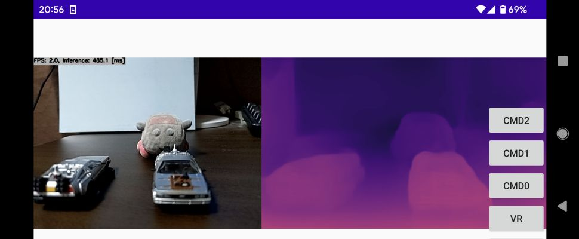

# Depth Estimation (FSRE-Depth) with MNN in C++

The above demo image is running on Android (MNN + Vulkan)

## How to Run
1. Please follow the instruction: https://github.com/iwatake2222/play_with_mnn/blob/master/README.md
2. Additional steps:
    - Download the model using the following script
        - https://github.com/PINTO0309/PINTO_model_zoo/blob/main/294_FSRE-Depth/download.sh
        - copy `fsre_depth_192x320/fsre_depth_full_192x320.onnx` to `resource/model/fsre_depth_full_192x320.onnx`
    - Convert model
        - `MNNConvert.exe -f ONNX --modelFile fsre_depth_full_192x320.onnx --MNNModel fsre_depth_full_192x320.mnn --bizCode biz`
    - Build  `pj_mnn_depth_fsre` project (this directory)

## Acknowledgements
- https://github.com/hyBlue/FSRE-Depth
- https://github.com/PINTO0309/PINTO_model_zoo
