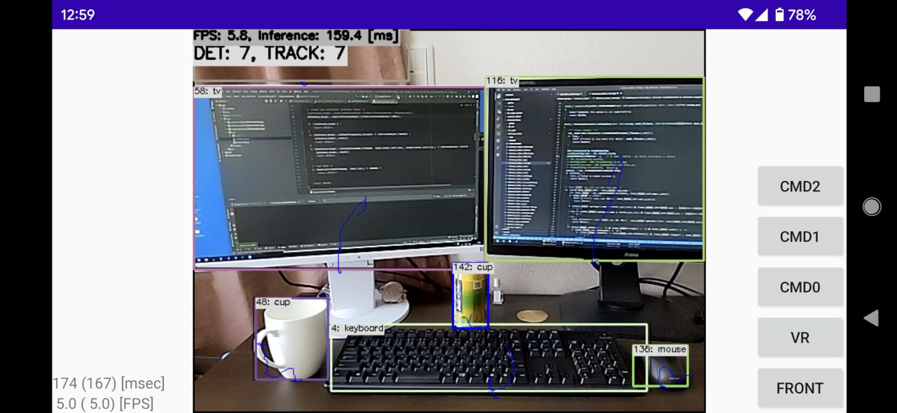

# YOLOv7 with MNN in C++
Sample project to run YOLOv7 + SORT

https://user-images.githubusercontent.com/11009876/178091422-46d944eb-d29e-4cd8-af5f-a48a8639d6e5.mp4

*yolov7-tiny_384x640 with Android (Pixel 4a)*

## How to Run
1. Please follow the instruction: https://github.com/iwatake2222/play_with_tensorrt/blob/master/README.md
2. Additional steps:
    - Download the model using the following script
        - https://github.com/PINTO0309/PINTO_model_zoo/blob/main/307_YOLOv7/download.sh
        - Convert `yolov7-tiny_384x640.onnx` using `01_script_convert/onnx2mnn.bat`
        - Place the generated MNN model to `resource/model/yolov7-tiny_384x640.mnn`
    - Build  `pj_mnn_det_yolov7` project (this directory)

## Acknowledgements
- https://github.com/WongKinYiu/yolov7
- https://github.com/PINTO0309/PINTO_model_zoo
