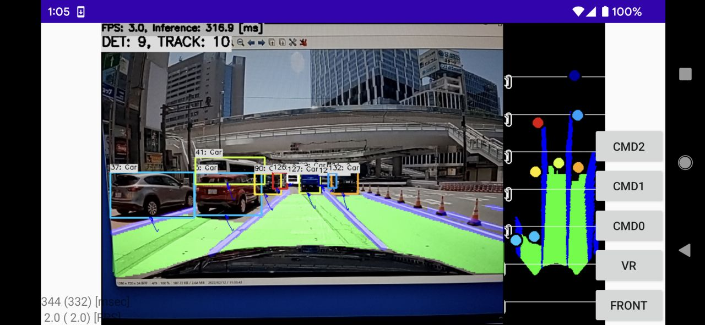

# YOLOPv2 with MNN in C++
Sample project to run YOLOPv2 + SORT + Bird's Eye View Transformation

## How to Run
1. Please follow the instruction: https://github.com/iwatake2222/play_with_mnn/blob/master/README.md
2. Additional steps:
    - Download the model using the following script
        - https://github.com/PINTO0309/PINTO_model_zoo/tree/main/326_YOLOPv2
        - Convert `yolopv2_256x320.onnx` using `01_script_convert/onnx2mnn.bat`
        - Place the generated MNN model to `resource/model/yolopv2_256x320.mnn`
    - Build `pj_mnn_perception_yolopv2` project (this directory)

## Acknowledgements
- https://github.com/CAIC-AD/YOLOPv2
- https://github.com/PINTO0309/PINTO_model_zoo
